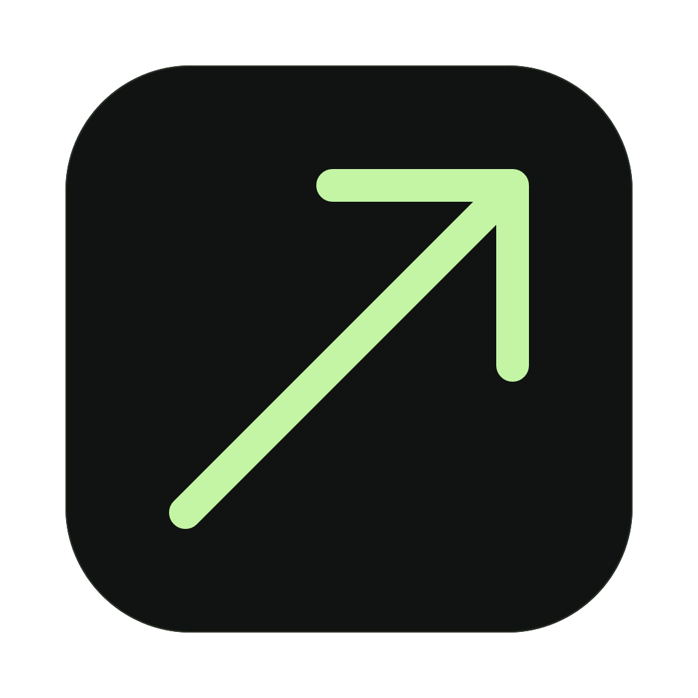
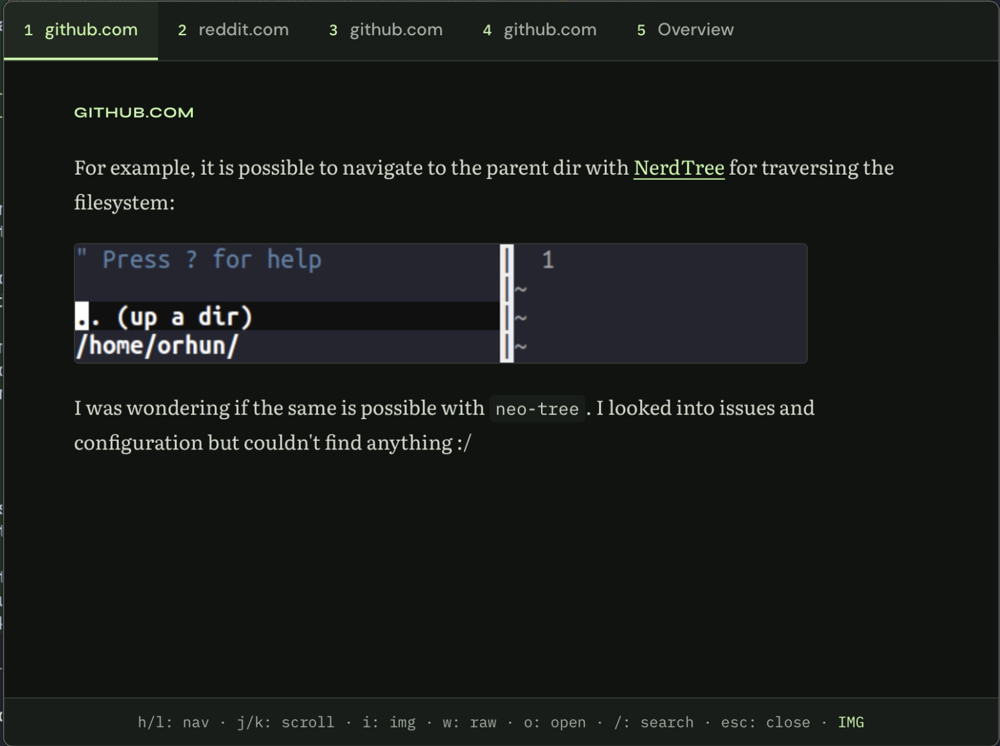

<p align="center">
  
</p>

<h1 align="center">Strafe</h1>

<p align="center">
  Search without interruption.<br>
  Search the web from any app on your Mac and read results with your keyboard.
</p>

<p align="center">
  <a href="https://github.com/ubernerd117/strafe/releases/latest">
    
  </a>
  
  
</p>

---

## Demo

[](https://strafe.sourab.tech/#watch)

[Watch on the website](https://strafe.sourab.tech/#watch) · [Open the video](landing/assets/strafe-demo.mp4)

## Download

**[Download Strafe for macOS (Apple Silicon)](https://github.com/ubernerd117/strafe/releases/latest)**

> Requires macOS 10.15+. On first launch, grant Accessibility permission for the global shortcut.

## What it does

Press `Option+Space` from any app on your Mac. Enter a query and read the results in a text reader.

Use `h` and `l` to switch articles and `j` and `k` to scroll. Press `o` to open the original page in your browser, or `Esc` to return to your work.

## Keybindings

| Key | Action |
|-----|--------|
| `h` / `l` | Previous / next page |
| `j` / `k` | Scroll down / up |
| `w` | Toggle raw website view |
| `i` | Toggle images |
| `o` | Open current page in browser |
| `/` | New search |
| `1`–`9` | Jump to page N |
| `Esc` | Dismiss window |

Raw view (including aliases) is an isolated, static preview. Page scripts, embedded frames, forms, and link navigation are disabled; styling and images are preserved. Keyboard controls still work after clicking inside the preview. Press `o` to use the full website in your browser.

## Setup

1. Open the DMG and drag Strafe to Applications
2. Launch Strafe from Applications
3. Press `Option+Space` to open the search bar
4. On first launch, enter your [Brave Search API key](https://brave.com/search/api/) (free tier: 2,000 searches/month)
5. Enter a query and press Enter

## Settings

Right-click the menu bar icon → **Settings**

- **Global shortcut**: change the key combination that opens Strafe
- **Results count**: how many pages to fetch (1–10)
- **Scroll speed**: j/k scroll multiplier
- **Default view**: text only, text + images, or raw website
- **Theme**: auto (follows system), dark, light, high contrast dark, high contrast light

## How it works

```
Option+Space → search bar → Enter
  → Brave Search API → top N URLs
  → Parallel fetch all pages (Rust/reqwest)
  → Strip with Readability.js → render clean text
  → Navigate with vim keys → Esc to dismiss
```

You can read the first result while Strafe fetches the remaining pages in parallel. Use the numbered tabs to switch between results.

## Tech stack

- [Tauri v2](https://v2.tauri.app/): native desktop shell
- Rust: search API calls, parallel page fetching
- TypeScript: UI, content stripping, keybindings
- [Readability.js](https://github.com/mozilla/readability): Mozilla's reader mode engine
- [Brave Search API](https://brave.com/search/api/): structured search results

## Build from source

```bash
# Prerequisites: Rust, Node.js
git clone https://github.com/ubernerd117/strafe.git
cd strafe
npm install
npm run tauri build
# DMG at src-tauri/target/release/bundle/dmg/
```

## License

MIT

## Visual identity and previews

The app and landing page share the sage arrow, charcoal surfaces, and typography roles. Dark mode uses `#101311`, `#c3f5a5`, and `#edece3`; light and high-contrast modes use matching green variants. DM Sans covers controls, Literata covers articles, Syne covers section labels, and IBM Plex Mono covers keyboard hints. Both surfaces load bundled fonts from `landing/fonts/`, with their OFL licenses.

Run `bun run dev` and open [the app appearance preview](http://127.0.0.1:1420/preview/app.html) to inspect actual components at native window sizes. The preview uses sample articles and an in-memory Tauri mock; it does not call search APIs or change your saved app settings. Use the screen and theme selectors to inspect the launcher, reader, setup, settings, and status states. This development page is not an entry point in the production app build.

The standalone landing page is in `landing/`. Generate platform icons with `bun branding/generate.ts`; see `branding/README.md` for the vector source and tray image format. The macOS menu bar uses a monochrome template arrow while the application uses the charcoal icon tile. Rebuild Strafe to include the new icons.
